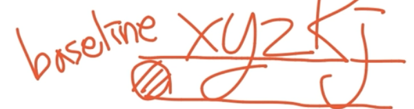
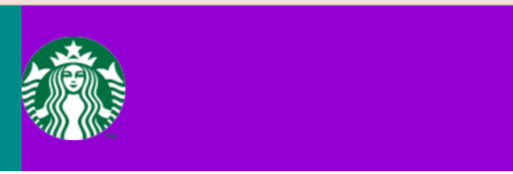
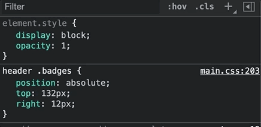

# 스타벅스 프로젝트
- 스타벅스 프로젝트를 진행하면서 배운 내용을 정리합니다.

# 아이콘과 폰트
### 파비콘(favicon, favorite icon)
- 프로젝트 루트에 fabicon.ico라는 파일이 있으면, 그걸 자동으로 사용한다
- 직접 파비콘을 설정한다면 아래와 같이 하면 된다
  ```html
  <link rel="icon" href="./favicon.png" />
  ```
### 오픈 그래프(The Open Graph Protocol)
**오픈 그래프란...**
- 카톡이나 디코에 웹사이트 링크를 올리면, 페이지를 소개하는 카드가 출력되는데, 이게 바로 오픈 그래프를 사용한다.
- 오픈그래프라는 것으로, 웹페이지가 소셜미디어로 공유될 때, 우선적으로 활용되는 정보를 지정하는 것이다.  

**오픈 그래프를 사용하는 방법**
- 오픈그래프는 페이지의 정보를 나타내는 메타 태그를 사용한다
- property라는 속성으로 넣고, 값으로 `og:`로 시작하는 값을 넣는다.
- 오픈 그래프는 최대한 간단하게 작성해야 한다. 안그러면 오픈그래프를 읽어갈 소셜미디어에서 악성사이트로 취급할 수도 있다!  

**다양한 오픈 그래프 속성들**
- `og:type`: 페이지의 유형(E.g, `website`, `video.movie`)
- `og:site_name`: 속한 사이트의 이름
- `og:title`: 페이지의 이름(제목)
- `og:description`: 페이지의 간단한 설명
- `og:image`: 페이지의 대표 이미지 주소(URL)
- `og:url`: 페이지 주소(URL)

### 구글 폰트 사용하기(Google Fonts)
**구글 폰트란...?**
- 브라우저마다 기본 폰트가 다르다. 
- 크로스 브라우징을 위해서, 폰트를 통일시켜주는게 좋다.
- 이때, 구글 폰트를 사용하면 예쁜 폰트를 우리 사이트에 적용할 수 있다.

**구글 폰트 주의사항**
- 폰트 중에 유료 폰트도 있으니까, 라이센스를 확인하고 사용해야한다
- 폰트를 선택할 때, 레귤러 사이즈랑 볼드 사이즈를 둘 다 선택해야 한다!
  ```
  예시)
    Regular 400
    Bold 700
  ```

### 마테리얼 디자인(Material Design)
- [링크](https://material.io/develop)
- [여기](https://material.io/develop/web/getting-started)로 들어가서 link태그를 복사하고 프로젝트에 붙여넣자
- [마테리얼 아이콘](https://fonts.google.com/icons)
- 마테리얼 아이콘은 무료로 쓸 수 있고, 사용하기도 쉽다
  ```html
  <span class="material-icons">login</span>
  ```
- 마테리얼 아이콘은 span 태그 안의 컨텐츠에 해당하는 아이콘을 찾아서 출력해준다

# HTML 태그

### header 태그
- 페이지의 헤더라는 의미를 가지고 있는 태그이다.
- 별 다른 기능은 없다. 그냥 div만들어서 써도 된다.

### baseline 문제
**이미지가 인라인 요소라서 발생하는 문제**
- 글자마다 크기에 차이가 있다.
- 무슨 소리냐면, 글자에는 baseline이라는게 있는데, x나 z같은건 baseline밑에 아무것도 없지만,  
  y나 j같은건 baseline아래로 글자가 약간 삐져나오게 된다.  
    
- 근데, 이미지 태그도 인라인 요소다보니, baseline때문에 수직 정렬이 안되는 문제가 발생한다

**해결방법**
- 이미지 태그를 블록 요소로 바꿔버리자
- 그러면 글자요소로 취급되지 않는다. baseline때문에 이미지가 붕 뜨는 문제도 없어진다.

### 마진 auto
- 너비가 있다면, 상하, 또는 좌우의 margin값을 auto로 잡아버리면 수직, 수평 정렬이 된다.  
    


### 부모는 none static, 자식은 absolute
- position값을 제목과 같이 주면, 자식 요소는 부모요소를 기준으로 위치를 잡는다.

### 링크 없는 a 태그
- `javascript:void(0)`를 사용하면 된다. 이렇게 하면 링크 기능이 동작하는 대신, 아무것도 하지 않는 자바스크립트가 실행되므로, 페이지 이동을 막을 수 있다.
- #은 해시라는 어떤 기능을 가지고 있어서, 아무 동작도 없는건 아니라서, javascript:void(0)를 추천한다고 한다.

# CSS 작업

### 선택자 작성하기
```css
header .main-menu {...}

header .main-menu .item .item__name {...}

header .main-menu .item:hover .item__name {...}

header .main-menu .item .item__contents {...}
...
```
- 상위 요소부터 하위요소까지 자식, 자손 선택자를 사용해서 하위 요소를 선택한다.
- 하위요소마다 클래스를 만들면 너무 많은 클래스가 생기니까, 이런 방식을 사용하는게 좋겠다.
- 다만, 이렇게 하면 같은 선택자를 중복해서 작성하는 문제가 있다. 이건 나중에 SCSS라는걸 사용해서 중복을 줄일 수 있다고 한다.

### BEM 방식(Block Element Modifier)
**BEM 방식이란?**
- BEM이란, 클래스 이름을 어떻게 지으면 좋을지에 대한 이름짓는 방법이다.
- BEM은 블록, 엘리먼트, 모디파이어를 가지고 이름을 짓는다.  
  각각 `__`와 `--`로 구분한다

**`__`와 `--`의 차이**
- `__`는 상위 요소의 일부분임을 나타낸다. `container__name`이라면, `name`은 `container`요소 안에 있는 요소가 된다.****
  ```html
    <div class="container">
      <div class="container__name"></div>
    </div>
  ```
- `--`는 상태를 나타낸다. `btn--primary`라면, `primary`는 `btn`의 상태를 나타낸다.
  ```html
  <div class="btn--primary"></div>
  ```

### position에 따른 가로너비 계산 차이
- 일반적인 블록요소는 가로너비를 최대한 늘리려고 한다.
- 그런데 position값이 fixed나 absolute로 부여된 요소는 가로너비가 최소한으로 줄어들려고 한다.

### 어떤 요소 A 위에 요소 B를 배치하기
- 상위요소의 position을 relative로 설정한다
- 하위요소 A와 B를 상위요소 안에 넣는다
- B의 position을 absolute로 설정한다.
  그 다음, left, top등의 스타일을 사용해서 요소를 배치한다.
  그러면 하위요소 A위에 요소 B가 배치되는 효과를 볼 수 있다.
    
  ```html
  <div class="swiper-slide">
    
    <a href="javascript:void(0)" class="btn">자세히 보기</a>
  </div>
  ```
# JS 작업

### window 객체
- 브라우저의 요소들과 자바스크립트 엔진, 그리고 모든 변수를 담고 있는 객체이다.
- 웹사이트만 담당하는 document와 달리, window는 브라우저 전체를 담당한다.
- document객체도 window객체 안에 있다.
- window객체를 사용해서 스크롤 이벤트 리스너에 콜백함수를 등록할 수 있다.
  ```javascript
  window.addEventListener('scroll', function () {
    console.log("scroll!");
  });
  ```

### lodash

- 내부구조가 좀 궁금해져서 한번 살펴봤는데, 이해하기 어려웠음.
- 함수 안에 함수를 선언하고, 그 함수를 호출했을 때, 스코프가 어떻게 되는지를 지금은 잘 알지 못함.
  근데 그걸 알아야 어떤 식으로 동작하는지를 알 수 있을 것 같다는 생각이 들었음
- 그리고 Function이라는 인터페이스랑, 이 안에 있는 apply라는 함수에 대해 좀 배워봐야 할 것 같음.
  지금 공부하지 말고, 나중에 파트3가서 좀 깊게 공부해보고, 다시 돌아와서 로대시의 쓰로틀 함수가 어떻게 동작하는지 봐야겠다는 생각이 들었음.
- 일단 지금으로선, 아래와 같은 것만 기억해두면 될 것 같다.
  - 로대시는 다양한 유틸함수를 제공한다.
  - 그 중에서 쓰로틀이라는 함수를 사용하면, 어떤 이벤트가 자주 발생해서 콜백함수가 너무 자주 호출되어서 웹페이지의 성능이 저하되는 문제를 막을 수 있다.
  - 첫번째 인자로 콜백함수를, 두번째 인자로 함수호출 간격(ms)을 넣으면 된다.

### GSAP

**gsap이란**
- JS를 가지고 애니메이션 처리를 할 수 있는 라이브러리이다.
- lodash랑 gsap을 사용해서 큰 성능저하 없이, 스크롤의 위치에 따라 요소에 애니메이션을 부여할 수 있다.

**gsap은 애니메이션에서 display: none을 사용할 수 있다**
- 정말 신기했던게, display: none은 트랜지션을 줄 수 없어서 애니메이션 효과를 줄 때 못쓰는걸로 알고 있었는데, gsap을 사용하면 가능하다.
- gsap이라고 용빼는 재주가 있는것도 아닌데 어떻게 가능한건지 궁금해서 자세히 보니까 정말 똑똑하게 구현되어있었다.  
    
  - 블록에서 none으로 가는 경우, 다른 트랜지션 효과가 끝나야 none으로 전환된다
  - 반대로, none에서 블록으로 가는 경우, 먼저 블록으로 전환된 후에 다른 트랜지션 효과가 시작된다.
  - 그래서 `display: none` 속성을 가지고 애니메이션을 줄 수 있었던 것이다.

**`gsap.to()` 사용하기**
```javascript
fadeEls.forEach((fadeInEl, index) => {
  gsap.to(fadeInEl, 1, {
    opacity: 1,
    delay: (index + 1) * 0.5
  });
});
```
- 첫번째 인자로 애니메이션을 적용할 요소를 넘긴다
- 두번째 인자로 애니메이션의 지속시간을 넘긴다
- 세번째 인자로 애니메이션 옵션을 넘긴다
  - 어떤 스타일로 애니메이션을 적용할지, delay는 얼마나 줄지 등을 넣으면 된다.

**`yoyo` 설정**
- 어떤 동작이 완료되면, 그 동작에 반대되는 동작을 하게 만드는 설정이다.
- y축 방향으로 10만큼 움직였다면, 반대로 -10만큼 움직여서 제자리로 돌아온다.
- 그래서 요요라고 부른다.
  ```javascript
    gsap.to(selector, 1, {
      y: size,
      repeat: -1,
      yoyo: true,
      ease: Power1.easeInOut,
      delay: random(0, delay),
    });
  ```

### swiper
- 요소 슬라이드를 구현할 때 사용할 수 있는 라이브러리
- 사용 예시
  ```javascript
  const swiper = new Swiper(".notice-line .swiper-container", {
    direction: "vertical",
    autoplay: true,
    loop: true
  });
  ```
  - new 키워드를 사용해서 Swiper객체를 생성한다
  - 생성자의 인자로, Swiper를 적용할 요소의 선택자를 넘긴다
  - 두번째 인자로 Swiper의 옵션을 객체로 담아 넘기면 된다

### youtube iframe api

- [api 소개](https://developers.google.com/youtube/iframe_api_reference?hl=ko)
- 유튜브 영상을 페이지에 넣을 수 있게 해주는 api이다.
- 객체에 설정을 담아서 넘기면, 자동재생과 같은 옵션을 킬 수 있다.
  ```javascript
  function onYouTubeIframeAPIReady() {
    new YT.Player('player', {
      videoId: 'An6LvWQuj_8',
      playerVars: {
        autoplay: true,
        loop: true,
        playlist: 'An6LvWQuj_8',
      },
      events: {
        onReady: function (event) {
          event.target.mute();
        }
      }
    });
  }
  ```

### ScrollMagic
```javascript
const spyEls = document.querySelectorAll("section.scroll-spy");
spyEls.forEach(function (spyEl) {
  new ScrollMagic
    .Scene({
      triggerElement: spyEl,
      triggerHook: 0.8
    })
    .setClassToggle(spyEl, "show)
    .addTo(new ScrollMagic.Controller());
});
```
- 스크롤의 위치에 따른 애니메이션을 구현할 때 사용하는 라이브러리
- Scene을 통해 감시하고자 하는 상황(요소, 스크롤 위치)을 지정한다
- setClassToggle 스크롤 위치에 따라 클래스를 토글한다
- addTo는 컨트롤러라는 개념을 위해 필요한 함수이다.

**triggerHook**
- viewPortHeight를 1이라고 할 때, 0부터 1 사이의 소수를 가지고 위치를 지정한다
- 그 위치에 스크롤이 들어오면 애니메이션이 재생된다.

# 기타

### HTML Entity
- html에는 `<, >`등의 특정 문자가 예약되어 있다.
- 예약되어 있는 문자를 웹페이지에 보여주고 싶다면, 반드시 HTML 엔티티로 바꿔서 적어야 한다.
- [참고 링크](https://www.w3schools.com/html/html_entities.asp)
- 스벅 예제에서는 `&copy`라는 엔티티를 사용해서 `©`를 표현했다.
